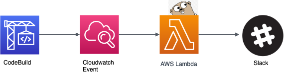

# CodeBuildSlack

AWS CodeBuildの実行結果をLambdaを使ってSlackに通知する

## デプロイ方法

```bash
$ make build
$ sls deploy --aws-profile <PROFILE> --slackurl <WEBHOOK_URL>
```

`$ make help`
```bash
build:             Build binaries
build-deps:        Setup build
deps:              Install dependencies
devel-deps:        Setup development
help:              Show help
lint:              Lint
```

## アーキテクチャ




## Cloudwatch Event (ルール)

- イベントパターン

```json
{
  "detail-type": [
    "CodeBuild Build State Change"
  ],
  "source": [
    "aws.codebuild"
  ],
  "detail": {
    "build-status": [
      "FAILED",
      "STOPPED",
      "SUCCEEDED",
      "IN_PROGRESS"
    ]
  }
}
```

## Lambda

serverless.ymlに記載

## Slack通知の結果


